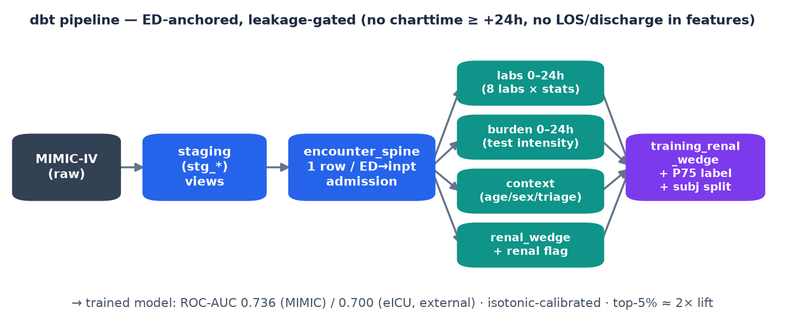
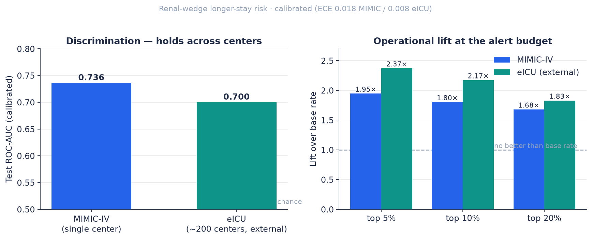

# Clinical LOS Radar — Early Length-of-Stay Risk, Done Honestly

An end-to-end clinical-ML case study: from raw MIMIC-IV to a **calibrated,
leakage-audited, externally-validated** model that flags hospital admissions at
high risk of a **longer stay** — early enough for case management to act.

**Stack:** dbt + DuckDB (SQL transformation & tests) · scikit-learn / LightGBM ·
MIMIC-IV + eICU (PhysioNet) · Python.

> This is an engineering/research portfolio project, **not** a clinical product.
> Outputs support *operational* decisions (bed/case-management prioritization),
> never treatment.

---

## TL;DR — what this project demonstrates

- **Framed a real, board-level problem** (hospital length-of-stay / throughput,
  grounded in the AHA *Cost of Caring 2025* report) and narrowed it to a single,
  testable wedge: **renal-dysfunction patients at risk of prolonged stay**.
- **Built a reproducible dbt pipeline** (ED-anchored, 0–24h) with **hard
  anti-leakage gates** and passing data tests.
- **Trained + isotonic-calibrated** a model: **ROC-AUC 0.736**, **top-5% precision
  82% / lift ~2×**, well-calibrated (**ECE 0.018**).
- **Externally validated on eICU** (~200 hospitals, retrained recipe): the signal
  holds at **ROC-AUC 0.700** (vs 0.736 on MIMIC) — single-center risk materially
  reduced.
- **Sized the economics honestly** (break-even / ROI) and **stated what is *not*
  proven** (the causal LOS reduction — that needs a prospective pilot).

The point of the project is not a model score; it is **doing clinical ML in a way
you can trust, defend, and ship** — leakage discipline, calibration, external
validation, and intellectual honesty about limitations.

> **Note on this repository.** This is a public *showcase*: write-up, figures, and
> the metric artifacts that back every number. The full implementation (dbt models,
> training/validation code) lives in a private repository — happy to walk through it
> live or share on request.

---

## The problem (grounded, not invented)

The AHA *Cost of Caring* (April 2025) names **longer stays, discharge delays, and
ED crowding** as primary financial pressures; labor is 56% of hospital cost and beds
are the constraint. Patients who will occupy a bed for a week are often identified
**too late**. Acute renal dysfunction is one of the report's fastest-growing,
costliest utilization drivers — and it is **measurable in the first hours** from
routine labs.

## Approach: a narrow, validated wedge

Rather than "predict LOS for everyone" (a crowded, commoditized space owned by Epic,
Qventus, LeanTaaS), this project deliberately picks **one cohort, one user, one
action**:

- **Cohort:** ED→inpatient adults with renal dysfunction in the first 24h
  (`creatinine_max > 1.3` OR `BUN_max > 20`).
- **User:** case management / ED operations (operational budget, not FDA-regulated).
- **Action:** a day-1 prioritized worklist → start post-acute placement &
  prior-authorization *earlier* (the documented discharge bottleneck).

A coverage analysis drove a key design decision: creatinine is present in only
**20% of admissions at 6h** but **66% at 24h** (median first creatinine ≈ 14h), so
the wedge is anchored at a **24h window** — with a "protocolized early creatinine"
path proposed for real-time 6h scoring in deployment.

## How it's built



```
raw (MIMIC-IV)
  └─ staging (stg_*)                         dbt views
       └─ encounter_spine_ed_inpatient       1 row / ED→inpatient admission
            ├─ labs_ed_w24h_dynamic          8 labs × {min,max,mean,first,last,delta,range,count,missing}
            ├─ burden_ed_w24h                testing-intensity features
            ├─ context_ed                    age, sex, admission type, ED triage acuity + vitals
            └─ renal_wedge_features          + renal_dysfunction_flag
                 └─ training_renal_wedge     cohort + long_stay label (P75) + subject-level split
```

**Engineering rigor that matters in production:**
- **Anti-leakage gates as tests:** no lab `charttime` outside `[ed_intime, +24h)`;
  no discharge/LOS columns in features; **no subject in two splits**.
- **Calibration:** isotonic/Platt picked by held-out Brier; reported via **ECE**
  (prevalence-aware) instead of a Brier threshold that is mathematically infeasible
  at this base rate.
- **Single source of truth:** the trainer reads the dbt mart directly, so the
  reported numbers and the pipeline can never silently drift apart.
- **Prevalence-aware evaluation:** operating points (top 5/10/20%) report
  precision + lift + the *recall ceiling*, not an impossible recall target.

## Results



| Population | ROC-AUC | Top-5% precision / lift | Top-10% precision / lift | ECE | base |
|---|---|---|---|---|---|
| **MIMIC-IV** (ED→inpatient, single center) | **0.736** | **82% / 1.95×** | 76% / 1.80× | 0.018 | 41% |
| **eICU** (ICU, ~200 hospitals) — external | **0.700** | 60% / **2.37×** | 55% / 2.17× | 0.008 | 25% |

Retrained on the multi-center eICU population, the renal-cohort signal **holds**
(**0.736 MIMIC → 0.700 eICU**), materially de-risking the single-center concern.
Within the cohort the prolonged-LOS rate is **41% vs 25% baseline (1.64× enrichment)**,
so the wedge concentrates risk *before* any model is applied. Every figure above is
reproduced from the committed artifacts in this repo
([`docs/renal_wedge_model_metrics.json`](docs/renal_wedge_model_metrics.json),
[`docs/eicu_external_validation.json`](docs/eicu_external_validation.json)).

**Economics (illustrative, honest):** at one large center the renal cohort sits on
~$30M/yr of *excess* bed-days; the early-creatinine protocol costs ≈ **0.23%** of
that pool, so a 5–10% LOS reduction would repay it many times over. See
[`docs/wedge_onepager_renal.md`](docs/wedge_onepager_renal.md).

## What this does NOT prove (read this)

- That earlier flagging **causally reduces** LOS. We proved the cohort is
  identifiable, rankable, and generalizes; whether earlier case-management action
  shortens the stay is **unproven** and is exactly what
  [`docs/pilot_design_renal_wedge.md`](docs/pilot_design_renal_wedge.md) is designed
  to measure. Prior "generic" LOS interventions in the literature often failed —
  likely because they didn't target the discharge bottleneck.
- Anything clinical. The flag prioritizes a scarce operational resource; it does not
  recommend treatment.

## What's in this showcase

| Path | What |
|---|---|
| [`docs/wedge_onepager_renal.md`](docs/wedge_onepager_renal.md) | business one-pager (problem → wedge → economics) |
| [`docs/radar_output_contract.md`](docs/radar_output_contract.md) | output contract + prevalence-aware targets |
| [`docs/pilot_design_renal_wedge.md`](docs/pilot_design_renal_wedge.md) | prospective pilot design + theory of change |
| [`docs/anti_leakage_phase3.md`](docs/anti_leakage_phase3.md) | how leakage is prevented (the design that earns trust) |
| [`docs/data_sources.md`](docs/data_sources.md) | datasets & governance |
| `docs/*_metrics.{json,md}`, `docs/eicu_external_validation.{json,md}` | the artifacts behind every number above |
| `assets/` | figures |

> Full pipeline code (dbt models, training & external-validation scripts) is kept in
> a private repository to respect data-use terms and keep this page clean. Available
> to walk through on request.

---

## Scope & data governance

- No patient-level data is included — only documentation, figures, and aggregate
  metric artifacts.
- MIMIC-IV / eICU accessed under credentialed PhysioNet terms; used for research only.
- Operational decision support, not medical advice; not an FDA medical device as scoped.
